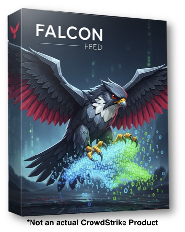

# Falcon Feed

A tool that allows you to capture data from a host and send it into CrowdStrike's Next-Gen SIEM without the use of a connector, leveraging the power of RTR (Real-Time Response) or F4IT (Falcon for IT).

## Software Use Disclaimer

This software is provided "as is". Please test in a sandbox environment before using in production.

---

## Features

- **Direct Data Capture:** Captures data directly from a host.
- **Dual Data Delivery:**
    - **JSON Scripting:** Saves host data as a JSON-formatted script for direct parsing within the Next-Gen SIEM.
    - **IT Automation Integration:** Sends host data to Falcon for IT to be displayed within the IT Automation dashboard and Next-Gen SIEM.
- **No Connector Required:** Streamlines the process by bypassing the need for traditional data connectors.
- **Agent-Based Integration:** Utilizes existing CrowdStrike agent capabilities (RTR or F4IT) to push data.

---

## How It Works

Falcon Feed uses CrowdStrike's Real-Time Response (RTR) or Falcon for IT (F4IT). It operates in one of two modes:

1.  **Script-JSON:** The tool saves the captured host data as a script in JSON format. This script can then be directly parsed and ingested by the Next-Gen SIEM for immediate analysis.
2.  **F4IT Integration:** Alternatively, Falcon Feed can send the captured host data to the Falcon for IT module. The data is then displayed within the IT Automation section of the CrowdStrike console and is available in the Next-Gen SIEM for further use.

This dual-path approach provides flexibility in how you choose to ingest your host data, depending on your specific operational needs.
